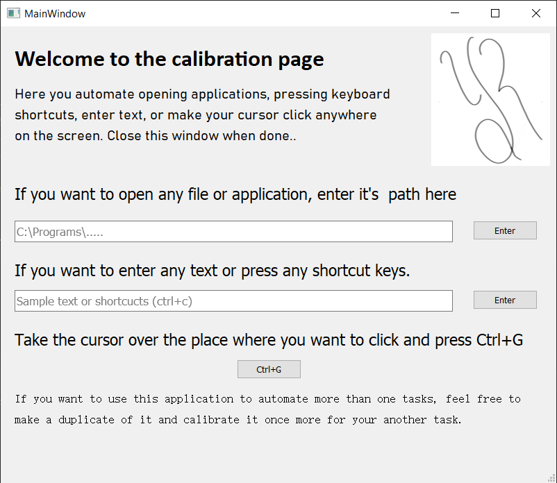

# Desktop automation using python
Welcome to my project. This project is built to automate tedious desktop tasks by automating your work like clicking mouse pointer 
at any location on screen, pressing keyboard shortcuts, typing any kind of text e.t.c.

One example where you can use this is, for opening browser and logging into any account of your choice with just one click.

##How to use:
Download this project in your desktop. Once you have downloaded it follow the steps:
* Run the calibrate.exe file. You should see a window like this

* All your commands will be stored in coordinates and shortcuts.txt file.
* After your calibration is done, all you have to do is to run your Run_Sequence.exe file by double tapping it.
